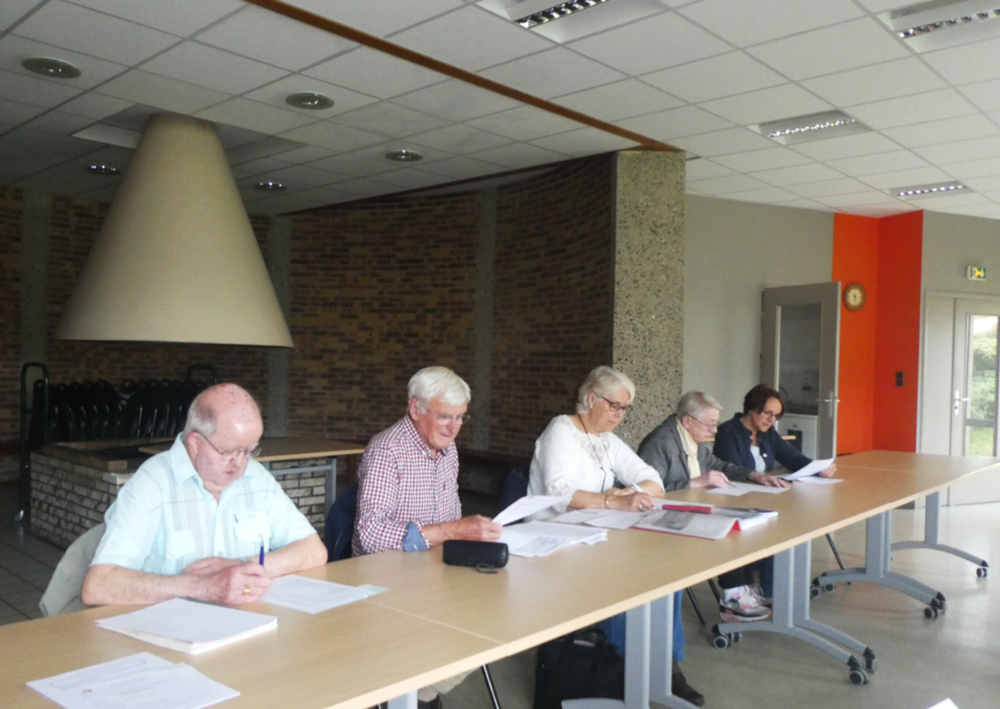
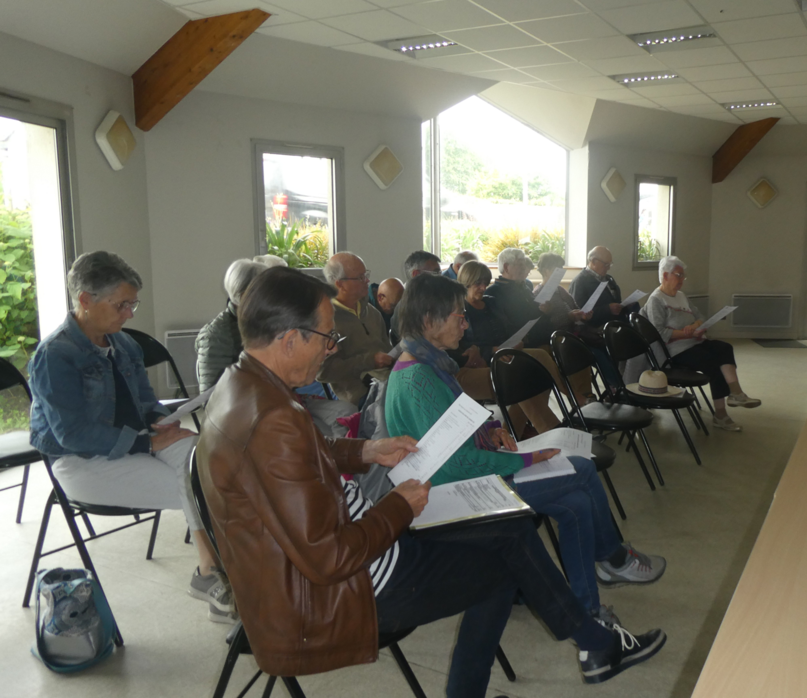

Le point d'orgue de cette assemblée a été un échange téléphonique avec Josué, qui a pu partager des nouvelles de Piela plutôt rassurantes par rapport aux conflits internes au Burkina Faso. Cette situation engendre cependant des déplacements de population importants et renforce les besoins en aide alimentaire et sanitaire.

Autres manifestations prévues : Vide grenier le 7 septembre 2025-Journée Liffré-Piéla le 16 novembre 2025.

