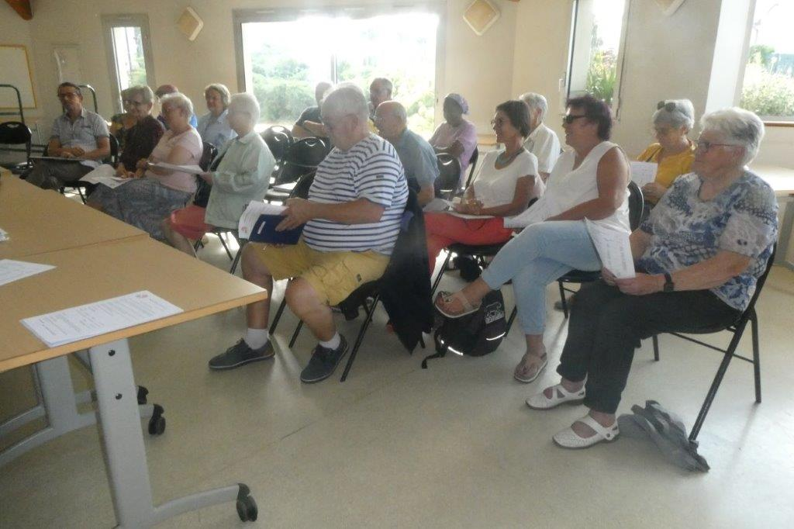
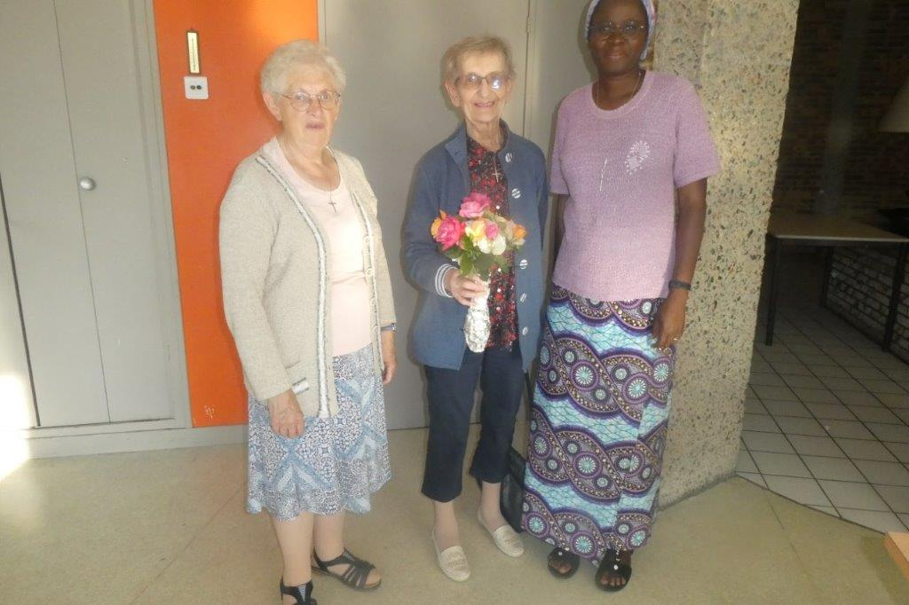

**Assemblée générale du samedi 02 Septembre 2023 à 17 h (Salle Concerto) Maurice Ravel**

21 présents 16 pouvoirs\
\
Excusés : Gilbert Guéguen, Michel Etienne, Dominique Reucheron et Victor Ribulé

\
En début de séance , après avoir remercié l'Assemblée de leur présence et de leur fidélité, le\
Président Louis Gieu a évoqué l'inquiétude grandissante au sujet du Burkina Faso, inquiétude qui\
s'étend désormais à toute l'Afrique. Il a rappelé que cette Assemblée générale était la 45ème\
puisque l'Association a été fondée en 1978.

\
Relecture point par point et en détail du bilan moral et financier par le président, bilan financier\
distribué à chaque présent dès leur amivée.\
On a pu constater que le loto avait été préparé avec rigueur par Denis Gouailler , mais qu'une fois\
de plus il a été annulé faute de salle. Le bol de riz ayant eu lieu comme en 2022  à l'extérieur\
derrière la mairie a connu un vif succès.\
Le bilan financier a été voté à l'unanimité. Décision de garder le même montant pour l'adhésion, à\
savoir 10€ minimum, et 20€ pour recevoir un reçu fiscal.\
Rappel de ce que représente l'Association la Toupie, et celle de Liffré-échange (vente de vêtements\
au Kilo ) . Tous les livres qui ne sont pas pris par le stand de livres sont apportés à Chevaigné qui\
collecte livres et journaux.

**Election du tiers sortant :** approuvé.

\
**Intervention de Soeur Eveline** religieuse Burkinabée qui revient du Burkina Faso , elle a pu\
ramener 5 kgs de beurre de Karité pour mettre en pot. Mèrci de cette aide précieuse. Cette dernière\
a fait une intervention très instructive sur la façon d'appréhender les nouvelles concernant le\
Burkina. Elle nous demande de bien filtrer nos informations, qui sont souvent biaisées et très loin de\
la population qui reste pourtant un soutien sans faille pour le président actuel. Elle déplore le\
manque de soutien international qui expose les fusillades et les tragédies, mais qui ne parle jamais\
de la solidarité et des avancées burkinabées.\
Concernant notre aide pour son pays, elle nous demande de réclamer beaucoup de justificatifs et de\
photos pour tous les projets réalisés, ne pouvant plus nous déplacer vu Ie contexte actuel.

\
**Intervention exceptionnelle par téIéphone relié à un ampli de Josué** notre représentant de\
I'A.D.D.E.S.P . Après ses remerciements, il nous a exposé la situation actuelle, et nous a rappelé\
que depuis 8 ans, le Burkina-Faso traverse une crise sans précédent. Les conséquences sont très problématiques\
populations déplacées, mais au niveau national beaucoup d'efforts fournis par l'Etat pour restaurer le territoire. Deux millions de déplacés internes, et au niveau de la partie Est de Piéla 22.000 personnes ont trouvé refuge. Ces déplacements massifs engendrent des problèmes de logement, les personnes sont logées dans les collèges et lycées ou dans des abris de fortune (paille et plastique), et également des problèmes de nourriture, de santé et d'accès à l'eau.

\
**Intéraction avec Josué sur les questions de I'Assemblée.**

\
- Si les Ecoles sont réquisitionnées où vont les enfants ?\
Pour l'instant collégiens et lycéens sont en vacances et reprendront leurs cours en octobre . quelle sera alors la solution pour loger tout ce monde ? on essaiera de trouver d'autres relogements.\
- Se pose t-il un problème d'alimentation ?\
Pour l'instant, nous pouvons encore approvisionner, mais nombreux se sont déplacés sans céréales,\
ont tout laissé dans leurs villages, travail, cultures, animaux.\
- Combien coûte un repas por personne et par jour ?\
Un repas, matin/midi/soir avec une seule céréale 1€50.\
Exemple criant : 100 kgs de céréales en 2021 coûtaient 15 000 cFA = 23 € En 2023=61 €\
- La guerre en Ukraine a t-elle des conséquences sur Ie pays ?\
Bien sûr ! coût du blé (pain) prix du carburant a augmenté de 40 %

\- L'A.D.D.EE.S.P. continue t-elle de fonctionner ?\
Oui elle continue de bien fonctionner, mais dans la partie Est certains secteurs ne sont plus\
accessibles .\
L'actualité parlait d'un convoi d'aide du Burkina Faso en direction du Niger , comment pouvons\
nous comprendre cette transaction ?\
Le Niger après la Côte d'Ivoire, reçoit beaucoup de Burkinabés, et c'est la solidarité africaine qui\
prime.\
En fin de séance , le Président nous a donné rendez-vous pour la braderie du dimanche 10\
septembre.

