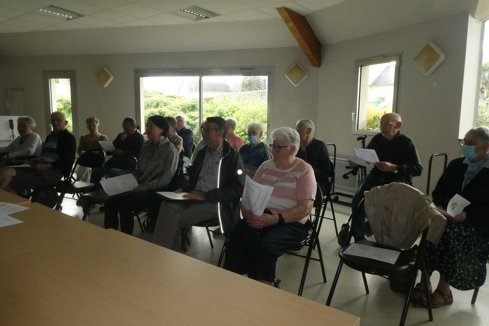

PVde l’Assemblée générale du samedi 8 juin 2024 15h (salle Boléro) Espace Maurice Ravel

27 présents 12 pouvoirs Excusés : Agnès Leray, Pierrette Terseul, Christophe Churin, Christian Misplon
Début de séance : Le Président Louis Gieu a évoqué la situation toujours préoccupante au Burkina Faso, la
région de Piéla connaissant une relative stabilité accueille 30 000 déplacés s’ajoutant aux 15 000 habitants
du centre, entraînant des problèmes d’approvisionnement en eau et nourriture.

Mémoire : une pensée émue pour Dominique Reucheron ancien membre décédée subitement en octobre
2023

Départ : Gilbert Guéguen membre actif a quitté l’association et a pris son envol pour le Finistère.

Relecture point par point et en détail du bilan moral et bilan financier du 31 decembre 2023. Pour le bilan
moral, nous gardons la même philosophie : aider nos amis Burkinabés les plus démunis impactés désormais
par les exactions et le réchauffement climatique .
Bilan financier distribué à chaque présent dès leur arrivée. Bilan financier voté à l’unanimité.
Projets 2024-2025 : Surtout réalisations de latrines, et virements pour combattre la famine.
Le Président a évoqué le Rescrit fiscal : Un nouveau document officialisé que nous avons dû remplir.

Remerciements pour toutes les aides accordées pour notre Association : La municipalité , le Crédit
Mutuel,l’Association La Toupie, libre- échange… La Municipalité était représentée par l’adjointe Madame
Anne-laure Ouled-Sghaïer. Cette dernière nous a incités à mettre dans le bulletin municipal ( le liffréen),
activités et photos pour rappeler le but de notre association .

Election du tiers sortant : Denis Gouaillier, Agnès Leray, Germaine Thomas, Odile Grégoire : approuvé .
Intervention exceptionnelle par téléphone relié à un ampli de : Josué notre représentant de
L’A.D.D.E.S.P.
Josué a évoqué les différents problèmes actuels : pluies abondantes, température élévée 43 ° la journée qui ne
baisse qu’à 38° la nuit , coupures d’electricité fréquentes.
Problème majeur : le déplacement des populations accueillies par Piéla, qui triple le nombre d’habitants
12.000 habitants et aujourd’hui : 45 000, générant des problèmes d’approvisionnement d’eau et de
nourriture. Heureusement , forages et pompes, châteaux d’eau aident à desservir cette nombreuse
population.
La question sur l’hygiène a été posée : beaucoup de sensibilisation sur les problèmes sanitaires et
l’insalubrité, pas d’épidémies pour l’instant.
Le paludisme, les pluies, les fortes chaleurs ont provoqué de nombreux décès chez les personnes les plus
âgées. Trois centres de santé à Piéla prennent bien en charge les malades.
Bon accompagnement de l’État pour l’installation des gens qui se réinstallent dans leur région (semences,
reconstitution de cheptel)
La Maison des Femmes qui distribue farine enrichie pour les bébés , de village en village, oeuvre toujours, le
moulin des farines existe encore .
Josué nous a transmis par mail :factures pour la construction de latrines et lave-mains accompagnées de
photos des différentes étapes.
Sur la demande de Josué, nous nous sommes branchés en mode caméra, et chaque personne a pu le saluer.
Cette fin d’Assemblée Générale a généré un partage visuel qui nous a enthousiamés !
Autres manifestations prévues

* Vide grenier le 8 septembre 2024
* Journée Liffré-Piéla le 17 novembre 2024.

  Odile Grégoire( Secrétaire)

