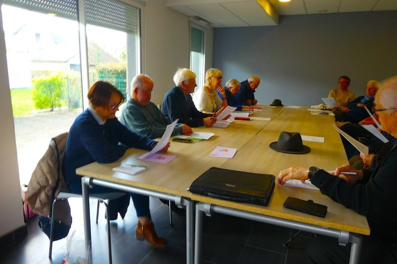

**Assemblée générale du samedi 28 Mars 2026**

\

<!--StartFragment-->

Après avoir évoqué la situation internationale,le président Louis Gieu a repris en détail le bilan  d'activités et financier de l'année 2025.

\-Grâce à nos actions: bol de riz, braderie de septembre,journée Liffré- Piéla de novembre

\-Grâce à nos 175 adhésions

\-Grâce à la subvention précieuse de la mairie de Liffré.

Nous avons pu faire parvenir à l'ADDESP(Association Départementale de Développement Économique et Social de la région de Piéla) la somme de 22000€. 

Cette somme a été utilisée :-pour le fonctionnement du dispensaire catholique

\-construction d'une cuisine scolaire

\-construction de latrines scolaire

Les projets pour 2026

\- Fonctionnement du dispensaire

\- Construction de latrines scolaire et familiales

\- Constitution d'un stock de céréales 

Nous avons pu échanger en visio avec Josué.

Il nous a parlé de la situation à Piéla.La région est relativement calme 

Il a été évoqué la possibilité de relation entre le lycée de Liffré et celui de Piéla.

Sœur Evelyne religieuse Burkinabé est intervenue.Elle a su nous préciser la mentalité des habitants du Burkina.

C'est un peuple pacifique et pour Elle il n'y a pas de guerre ethniques ,mais plutôt des attaques autour des ressources minières(or)

<!--EndFragment-->

