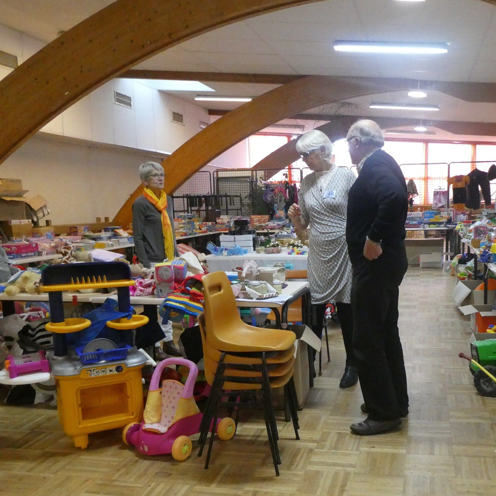
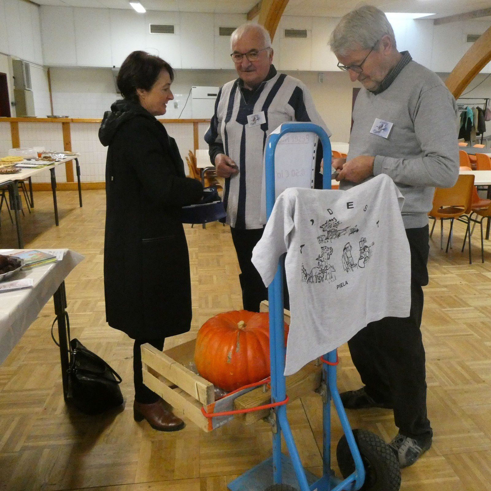
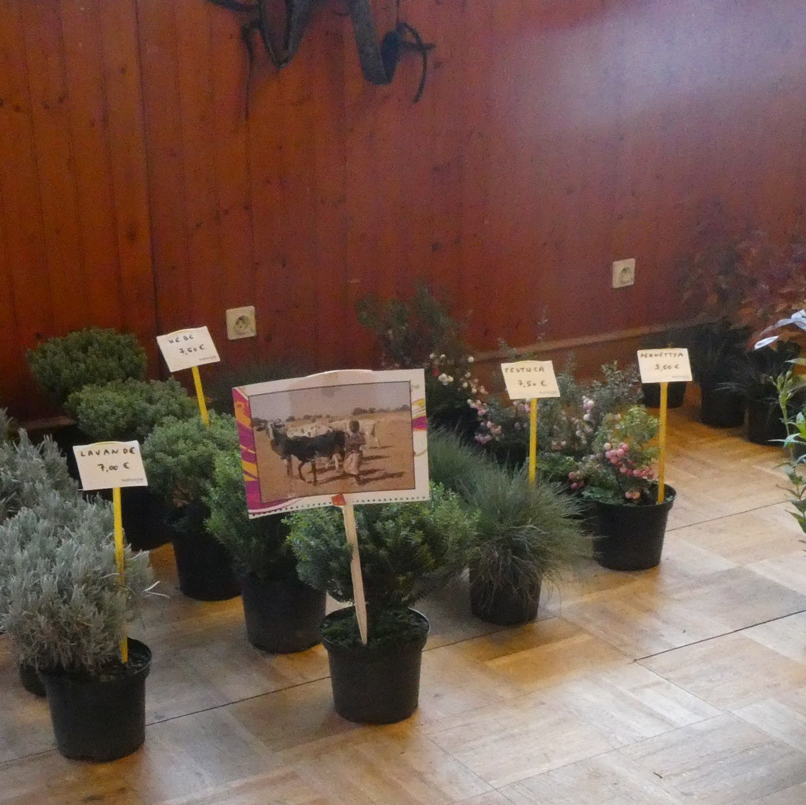

Les visiteurs étant nombreux, le dimanche 10 novembre 2019, pour la journée au profit de Piéla (Burkina-Faso) organisée par l'Association Liffré-Piéla.

Le Président Louis Gieu a relaté les compliments reçus lors de l'Assemblée Départementale pour le soutien important à la localité africaine de Piéla.

Une subvention a été attribuée par le Département à notre Association.

La journée s'est passée dans une bonne ambiance et la bonne humeur.

