Le point d'orgue du quarantième anniversaire de l'Association s'est tenu ce dimanche lors d'un repas de 160 convives, les personnes inscrites et les personnalités ont été accueillies par Louis Gieu, président de l'association Liffré-Piéla.

Il a d'abord rappelé le soutien sans faille des maires successifs, Clément Théaudin, Loïg Chesnais Girard et Guillaume Bégué et souligné l'importance  des actions entreprises pour le soutien  des populations de Piéla. 

Cette année encore, les conditions climatiques mauvaises ont nui à la production du mil....

C'est ce qu'ont indiqué successivement Josué Ouoba, secrétaire de l'ADDESP (Association départementale pour le développement économique et social du secteur de Piéla) et Daniel Nadinga, maire des 72 000 habitants des 38 villages aidés. 

"Dans certaines classes primaires, l'on compte parfois, 100 élèves et le mobilier manque, des communes attendent encore des forages..." 

Bref l'association Liffréenne doit continuer son action et M. Gieu  a remercié la commune de Liffré " pour son soutien qui assure 1/3 de l'argent collecté chaque année , un autre tiers étant abondé par les diverses manifestations annuelles de Liffré-Piéla et le dernier tiers, par les cotisations des adhérents. "

Le maire Guillaume Bégué, qui était accompagné de plusieurs adjoints, a dit sa volonté que la commune, continue à soutenir le développement de Piéla et de sa région. 

Loïg Chesnais-Girard, président du Conseil régional s'est réjoui, de l'aide à Piéla et, surtout de la bonne entente qui règne à Liffré-Piéla entre des membres qui viennent de tous les horizons philosophiques : " C'est cela la vraie laïcité, s'accueillir, se respecter, et travailler ensemble au bien de tous !"

Près de 70 personnes ont assisté, lundi, au débat animé par Daniel Nadinga et Josué Ouoba. Ils ont notamment souligné que la pluralité des ethnies et des langues correspondantes rendent difficiles les prises de décision, la scolarité.

L'auditoire , au jeu des questions réponses, a, de nouveau, vu l'importance de la continuité du soutien, pour le développement d'une région au climat difficile. 

Sont réalisés à ce jour, précisait Louis GIEU: 13 forages, 8 classes de primaire et autant pour le Lycée, 7 logements d'enseignants et aide au dispensaire des sœurs de Rillé, dont des collè

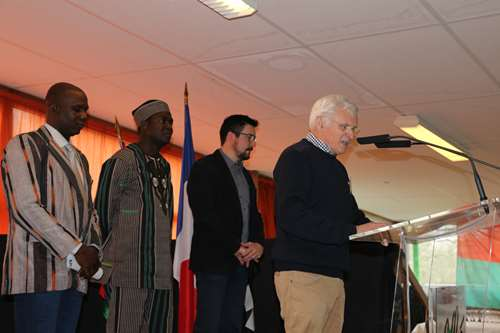

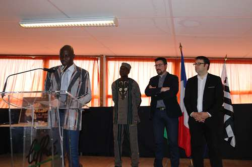

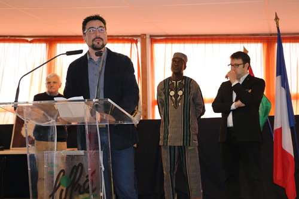

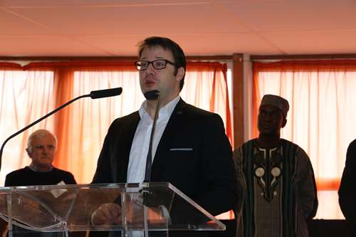

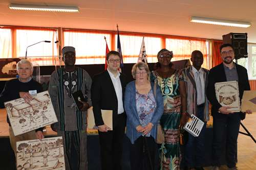

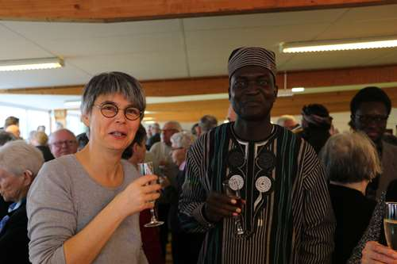

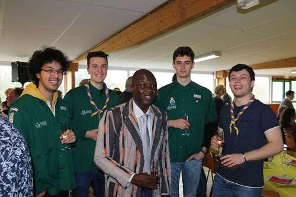

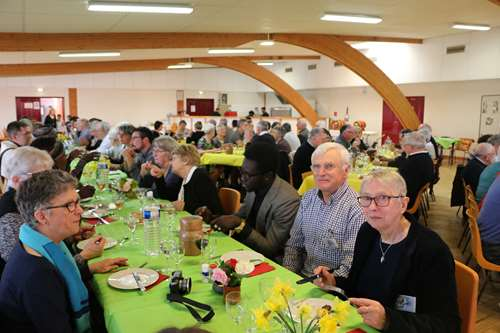

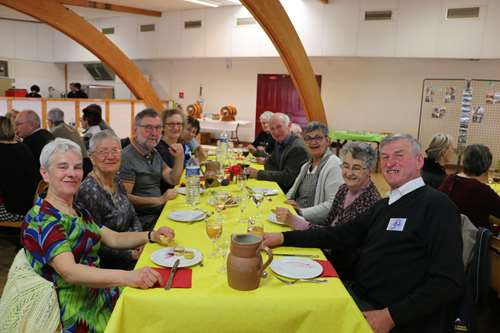

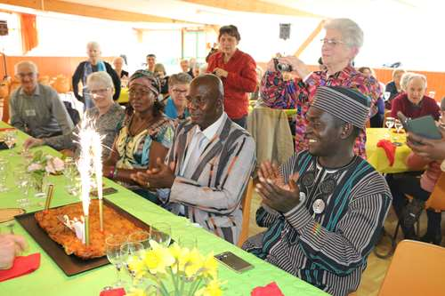

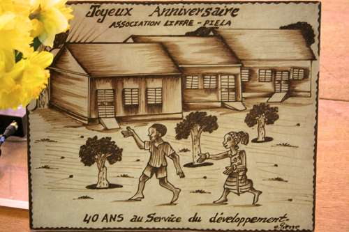

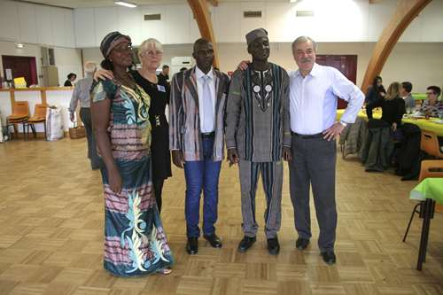

gues relayèrent l'appel à l'aide de 1977. La supérieure, Mère Marie-Angèle assistait aussi à la fête de dimanche.