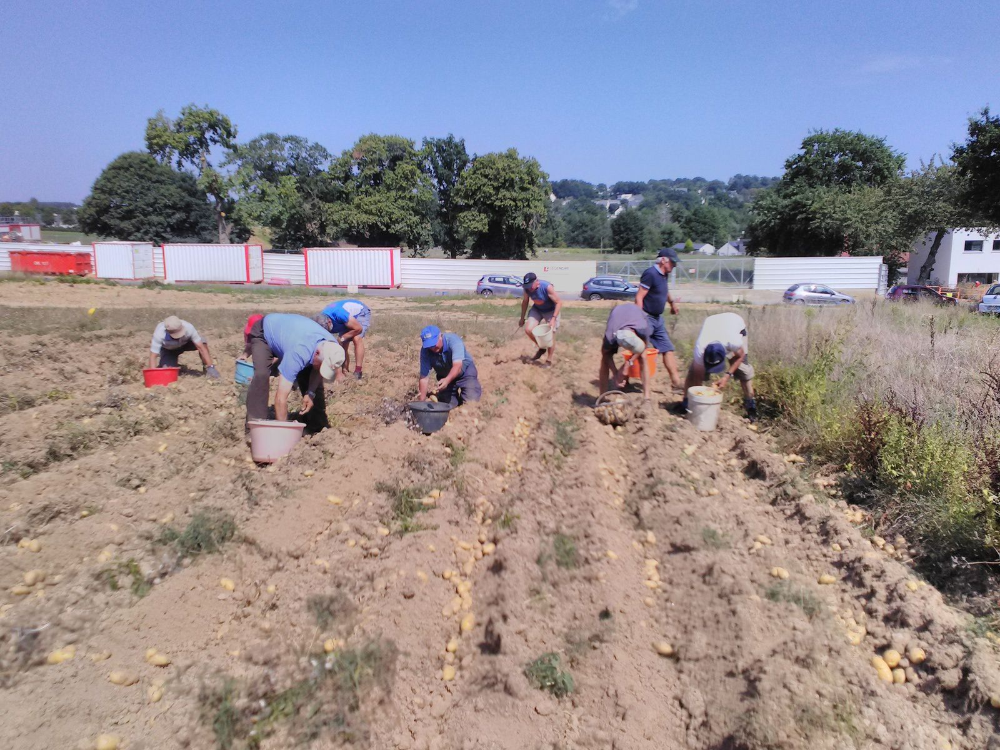
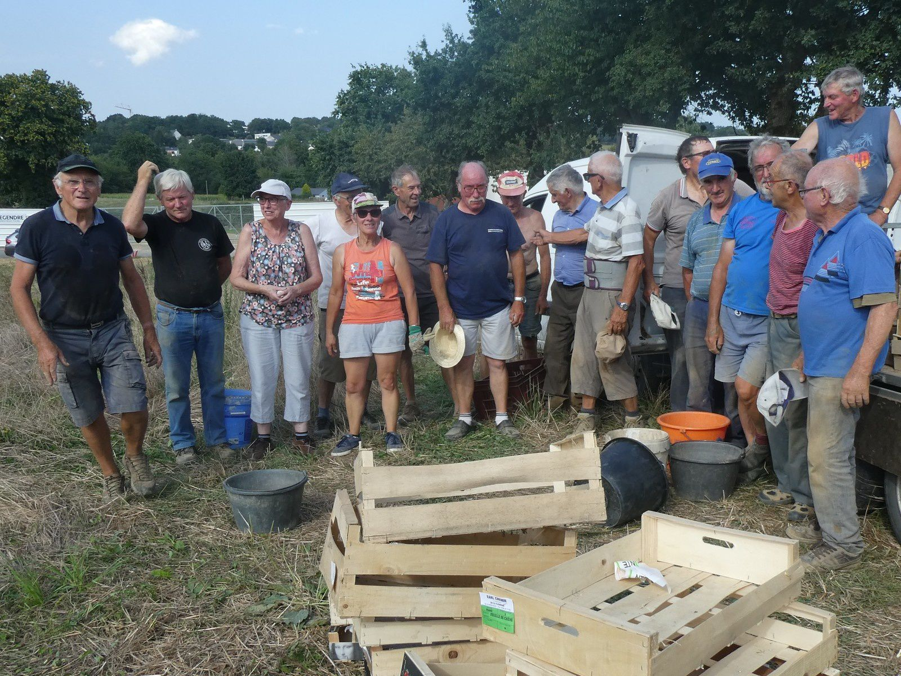

En cette fin d'été, une vingtaine de bénévoles se sont retrouvés sur le terrain, mis gracieusement à disposition par la Société GIBOIRE que nous remercions, pour la traditionnelle récolte des pommes de terre.

Ils ont ainsi récolté environ 2 tonnes de pommes de terre. La vente permettra de  continuer à financer les projets en cours et à venir au bénéfice du secteur de Piéla au Burkina Faso.

 secteur de Piéla au Burkina-Faso.